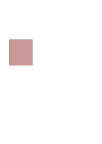

# Janus.jl
## A simple Julian Doorway-Window implementation

> “You see, Sasha,” said Roman, addressing me, “we have an ideal director. He is one director in two individuals. There is a Janus-A Poluektovich and a Janus-U Poluektovich. Janus-U is an important scientist with international stature. As for Janus-A, he is a rather ordinary administrator.”

--- Monday begins on Saturday, Boris and Arkady Strugatsky. 

## Implementation task list

Intention is to keep this package relatively lightweight and simple, and then
play with what we can model. 

- [ ] valid physics #@_@#
- [x] GSB 
- [x] SE
- [ ] ESA
- [ ] 2D-spectroscopy
- [ ] Dephasing

Not currently planned: strong field, polarisation. 

## References

Janus.jl is a simplified Julian reimplementation of the Doorway-Window
approach, and is probably best considered a simplified rewrite of the
https://codeberg.org/apolionl/WaveMixings.jl package. 

